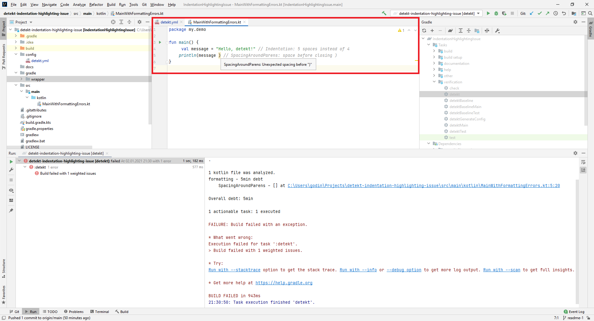
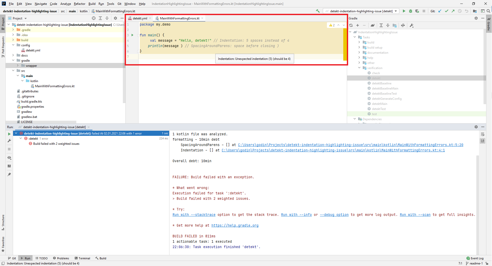
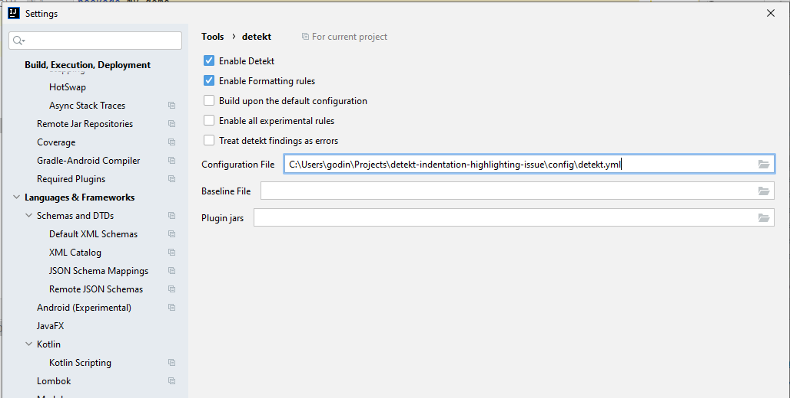

## Expected Behavior
Intellij IDEA highlights a line (or first symbol in a line), where **Indentation** issue is found.
Hoovering mouse over highlighted area shows tooltip with the issue description.

Below is screenshot with correct highlighting and issue description from **SpacingAroundParens** rule.


## Observed Behavior
Whole file content is highlighted, making it impossible to find violation (including other types of rules).
Hoovering mouse over random place of file shows correct violation description, but its impossible to find its location.

Below is screenshot with the problem from testing project to reproduce the issue.


## Steps to Reproduce
- Download and build test project: https://github.com/godiale/detekt-indentation-highlighting-issue
- Install detekt IntelliJ plugin and configure it as below:
    - Enable Detekt = Y
    - Enable Formatting rules = Y
    - Build upon the default configuration = N
    - Enable all experimental rules = N
    - Treat detek findings as errors = N
    - Configuration file = https://github.com/godiale/detekt-indentation-highlighting-issue/blob/main/config/detekt.yml
    - Baseline File = <empty>
    - Plugin jars = <empty>



## Context
The issue duplicates https://github.com/detekt/detekt-intellij-plugin/issues/105, with more reproduction details.
However I think placing it to detekt iself is more correct, because seems the problem is not in displaying code smell, but rather in the way how its reported.
I built detekt itself to investigate and found that ```location``` in [**FormattingRule**](https://github.com/detekt/detekt/blob/v1.15.0/detekt-formatting/src/main/kotlin/io/gitlab/arturbosch/detekt/formatting/FormattingRule.kt#L65) for Indentation is created so that ```TextLocation``` is created
with values (0, number_of_symbols_in_source_file).
```
            val location = Location(
                SourceLocation(line, column),
                TextLocation(node.startOffset, node.psi.endOffset),
                root.absolutePath().toString()
            )
```

## Your Environment
* Version of detekt used: 1.15.0
* Version of detekt IntelliJ plugin used: 1.6.1
* Version of Gradle used (if applicable): 6.7
* Operating System and version: Windows 10 Pro
* Version of IntelliJ IDEA: Community 2020.3.1 Build #IC-203.6682.168, built on December 29, 2020
* Runtime version: 11.0.9.1+11-b1145.63 amd64
* Link to your project (if it's a public repository): https://github.com/godiale/detekt-indentation-highlighting-issue
